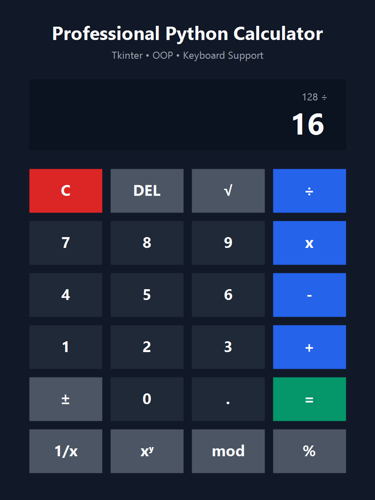

# Professional Python Calculator


A polished desktop calculator built with Python and Tkinter. The project uses an object-oriented architecture, clean code practices, keyboard support, and a modern responsive interface suitable for a professional GitHub portfolio.

## Features

- Addition, subtraction, multiplication, and division
- Percentage, square root, power, modulus, and reciprocal operations
- Clear, modern Tkinter user interface
- Responsive button layout
- Keyboard input support
- Friendly error handling for invalid operations
- Object-oriented, maintainable Python code
- No third-party runtime dependencies

## Screenshot



## Installation

Clone the repository:

```bash
git clone https://github.com/your-username/professional-python-calculator.git
cd professional-python-calculator
```

Create and activate a virtual environment:

```bash
python -m venv .venv
```

Windows:

```bash
.venv\Scripts\activate
```

macOS/Linux:

```bash
source .venv/bin/activate
```

Install dependencies:

```bash
pip install -r requirements.txt
```

Tkinter ships with most Python installations, so no additional packages are required.

## Usage

Run the application:

```bash
python calculator.py
```

Keyboard shortcuts:

- Number keys: enter digits
- `+`, `-`, `*`, `/`, `^`, `%`: select operations
- `Enter` or `=`: calculate result
- `Backspace`: delete the last digit
- `Esc`: clear the calculator

## Technologies Used

- Python 3.12+
- Tkinter
- Object-Oriented Programming
- Standard Library only

## Project Structure

```text
calculator/
├── calculator.py
├── requirements.txt
├── LICENSE
├── .gitignore
├── README.md
└── screenshots/
    └── calculator-preview.png
```

## Future Improvements

- Add calculation history
- Add scientific calculator mode
- Add memory buttons
- Add theme switching
- Add automated unit tests for calculation logic

## Author

Created by **Ritul**.

Update this section with your GitHub profile, portfolio, and contact links.

## License

This project is licensed under the MIT License. See the [LICENSE](LICENSE) file for details.

## GitHub Setup

Initialize Git and push to GitHub:

```bash
git init
git add .
git commit -m "Initial commit: professional Python calculator"
git branch -M main
git remote add origin https://github.com/your-username/professional-python-calculator.git
git push -u origin main
```
